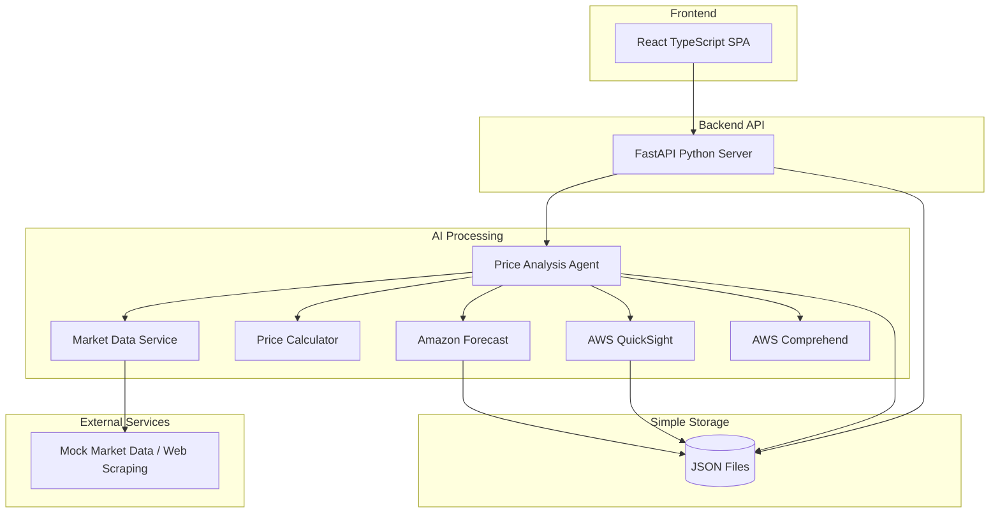

# Design Document

## Overview

The Farmer Budget Optimizer is a serverless web application built on AWS that uses AI agents to provide intelligent price optimization for agricultural inputs. The system follows a microservices architecture with a React TypeScript frontend, Python-based AI agents, and AWS managed services for scalability and cost-effectiveness.

## Architecture

### Simplified MVP Architecture



### Technology Stack

**Frontend:**
- React 18 with TypeScript
- Tailwind CSS for styling
- Axios for API calls
- Deployed as static files

**Backend:**
- FastAPI (Python 3.11) for REST API
- Uvicorn for ASGI server
- Simple file-based storage (JSON)
- Deployed on single EC2 instance or local development

**AI/ML:**
- AWS QuickSight for data visualization, trend analysis, and intelligent insights
- Amazon Forecast for price prediction and seasonality analysis
- AWS Comprehend for market sentiment analysis from news/reports
- QuickSight Q (natural language queries) for intelligent recommendations
- Custom Python modules for price calculations using AWS insights
- Pandas/NumPy for statistical analysis
- Web scraping for market data (BeautifulSoup/Scrapy)

## Components and Interfaces

### Frontend Components

#### 1. Product Input Form
```typescript
interface ProductInput {
  id?: string;
  name: string;
  quantity: number;
  unit: string;
  specifications?: string;
  preferredBrands?: string[];
  maxPrice?: number;
}

interface FarmInfo {
  location: {
    streetAddress: string;
    city: string;
    state: string;
    county: string;
    zipCode: string;
    country: string;
  };
  farmSize: number;
  cropTypes: string[];
}
```

#### 2. Budget Report Display
```typescript
interface PriceAnalysis {
  productId: string;
  productName: string;
  effectiveDeliveredCost: {
    p10?: number;
    p25?: number;
    p35?: number;
    p50?: number;
    p90?: number;
  };
  targetPrice?: number;
  confidenceScore: number;
  suppliers: SupplierRecommendation[];
  recommendations: OptimizationRecommendation[];
  dataLimitations: string[];
}

interface SupplierRecommendation {
  name: string;
  price: number;
  deliveryTerms?: string;
  leadTime?: number;
  reliability?: number;
  moq?: number;
  contactInfo?: string;
  location?: string;
}

interface OptimizationRecommendation {
  type: 'BULK_DISCOUNT' | 'TIMING' | 'SUBSTITUTE' | 'GROUP_PURCHASE';
  description: string;
  potentialSavings: number;
  actionRequired: string;
}
```

### Backend API Endpoints

#### 1. Analyze Product List (Synchronous)
```
POST /api/analyze
Content-Type: application/json

{
  "farmLocation": {
    "streetAddress": string,
    "city": string,
    "state": string,
    "county": string,
    "zipCode": string,
    "country": string
  },
  "products": [
    {
      "name": string,
      "quantity": number,
      "unit": string,
      "specifications": string
    }
  ]
}

Response: {
  "productAnalyses": [
    {
      "productId": string,
      "productName": string,
      "analysis": PriceAnalysis,
      "individualBudget": {
        "low": number,
        "target": number,
        "high": number,
        "totalCost": number
      },
      "dataAvailability": {
        "priceDataFound": boolean,
        "supplierDataFound": boolean,
        "forecastDataAvailable": boolean,
        "sentimentDataAvailable": boolean,
        "missingDataSections": string[]
      }
    }
  ],
  "overallBudget": {
    "low": number,
    "target": number,
    "high": number,
    "totalCost": number
  },
  "dataQualityReport": {
    "overallDataCoverage": number,
    "reliableProducts": string[],
    "limitedDataProducts": string[],
    "noDataProducts": string[]
  },
  "generatedAt": ISO8601
}
```

#### 2. Health Check
```
GET /api/health

Response: {
  "status": "healthy",
  "timestamp": ISO8601
}
```

### AI Agent Architecture

#### 1. AWS BI-Powered Price Analysis Agent
```python
class PriceAnalysisAgent:
    def __init__(self):
        self.market_service = MarketDataService()
        self.calculator = PriceCalculator()
        self.forecast_client = boto3.client('forecast')
        self.quicksight_client = boto3.client('quicksight')
        self.comprehend_client = boto3.client('comprehend')
    
    async def analyze_product_list(self, products: List[ProductInput], farm_info: FarmInfo) -> List[PriceAnalysis]:
        # Enhanced analysis pipeline with AWS BI tools
        analyses = []
        for product in products:
            # Get current market data
            market_data = await self.market_service.get_current_prices(product.name, farm_info.location)
            
            # Use Amazon Forecast for price predictions
            price_forecast = await self.get_price_forecast(product.name, market_data)
            
            # Analyze market sentiment with Comprehend
            sentiment_analysis = await self.analyze_market_sentiment(product.name)
            
            # Calculate effective costs
            price_analysis = self.calculator.calculate_comprehensive_analysis(
                market_data, price_forecast, sentiment_analysis, farm_info.location
            )
            
            # Generate AWS BI-powered recommendations
            recommendations = await self.generate_aws_bi_recommendations(
                price_analysis, price_forecast, sentiment_analysis
            )
            
            analyses.append(price_analysis)
        
        return analyses
    
    async def get_price_forecast(self, product_name: str, historical_data: List[PriceQuote]) -> ForecastResult:
        # Use Amazon Forecast to predict future prices based on historical data
        # This provides seasonality analysis and trend predictions
        pass
    
    async def analyze_market_sentiment(self, product_name: str) -> SentimentAnalysis:
        # Use AWS Comprehend to analyze market news and reports
        # Extract sentiment about supply/demand factors
        pass
    
    async def create_quicksight_dashboard(self, analysis_data: List[PriceAnalysis]) -> QuickSightInsights:
        # Create dynamic QuickSight dashboard for price trends visualization
        # Use QuickSight's ML-powered insights and anomaly detection
        # Return dashboard URL and intelligent insights
        pass
    
    async def get_quicksight_insights(self, product_name: str) -> QuickSightInsights:
        # Use QuickSight's ML Insights to automatically detect:
        # - Price anomalies and outliers
        # - Seasonal patterns and trends
        # - Correlation with external factors
        # - Forecasting insights with confidence intervals
        pass
    
    async def generate_aws_bi_recommendations(self, 
                                            price_analysis: PriceAnalysis,
                                            forecast: ForecastResult,
                                            sentiment: SentimentAnalysis,
                                            quicksight_insights: QuickSightInsights) -> List[OptimizationRecommendation]:
        # Pure AWS BI-powered recommendations using data-driven insights
        recommendations = []
        
        # Forecast-based timing recommendations
        if forecast.trend == "declining" and forecast.confidence > 0.8:
            optimal_date = forecast.lowest_price_date
            savings_amount = forecast.current_price - forecast.predicted_lowest_price
            recommendations.append(OptimizationRecommendation(
                type="TIMING",
                description=f"Amazon Forecast predicts {forecast.decline_percentage:.1f}% price drop",
                potentialSavings=savings_amount,
                actionRequired=f"Delay purchase until {optimal_date}",
                confidence=forecast.confidence
            ))
        
        # QuickSight anomaly detection recommendations
        if quicksight_insights.price_anomaly_detected:
            recommendations.append(OptimizationRecommendation(
                type="ANOMALY_ALERT",
                description=f"QuickSight detected unusual price pattern: {quicksight_insights.anomaly_description}",
                potentialSavings=quicksight_insights.potential_impact,
                actionRequired=quicksight_insights.recommended_action,
                confidence=quicksight_insights.anomaly_confidence
            ))
        
        # Comprehend sentiment-based recommendations
        if sentiment.supply_risk_score > 0.7:
            recommendations.append(OptimizationRecommendation(
                type="SUPPLY_RISK",
                description=f"Market sentiment analysis indicates {sentiment.risk_level} supply risk",
                potentialSavings=0,
                actionRequired="Consider securing inventory or finding alternative suppliers",
                confidence=sentiment.confidence_score
            ))
        
        # QuickSight seasonal pattern recommendations
        if quicksight_insights.seasonal_pattern_detected:
            best_month = quicksight_insights.optimal_purchase_month
            seasonal_savings = quicksight_insights.seasonal_savings_potential
            recommendations.append(OptimizationRecommendation(
                type="SEASONAL_OPTIMIZATION",
                description=f"Historical data shows {seasonal_savings:.1f}% lower prices in {best_month}",
                potentialSavings=seasonal_savings,
                actionRequired=f"Plan purchases for {best_month} if timing allows",
                confidence=quicksight_insights.pattern_confidence
            ))
        
        return recommendations
```

#### 2. Market Data Service (MVP)
```python
class MarketDataService:
    def __init__(self):
        self.cache_file = "market_data_cache.json"
        self.mock_data_enabled = True  # For MVP, use mock data
    
    def get_current_prices(self, product_name: str, location: str) -> List[PriceQuote]:
        # For MVP: Use mock data or simple web scraping
        # Later: Integrate with real agricultural APIs
        pass
    
    def get_mock_prices(self, product_name: str) -> List[PriceQuote]:
        # Generate realistic mock prices for MVP testing
        pass
    
    def cache_prices(self, product_name: str, prices: List[PriceQuote]):
        # Simple JSON file caching
        pass
```

#### 3. Price Calculator
```python
class PriceCalculator:
    def calculate_effective_delivered_cost(self, quote: PriceQuote, farm_location: Location) -> EffectiveCost:
        # Apply the comprehensive economic analysis framework
        base_price = self.normalize_to_base_uom(quote)
        logistics_cost = self.calculate_logistics(quote, farm_location)
        taxes_fees = self.calculate_taxes_and_fees(quote, farm_location)
        wastage_adjustment = self.apply_wastage_factor(quote.product_type)
        
        return EffectiveCost(
            base=base_price,
            logistics=logistics_cost,
            taxes=taxes_fees,
            total=base_price + logistics_cost + taxes_fees + wastage_adjustment
        )
    
    def calculate_price_ranges(self, effective_costs: List[float]) -> PriceRanges:
        # Calculate p10, p25, p35, p50, p90 percentiles
        # Remove outliers using MAD or IQR
        pass
    
    def calculate_confidence_score(self, quotes: List[PriceQuote]) -> float:
        # Based on number of sources, freshness, dispersion, availability
        pass
```

## Data Models

### Enhanced Data Storage with AWS BI Integration

#### 1. Market Data Cache (JSON + S3 for Forecast)
```python
# market_data_cache.json
{
  "product_hash": {
    "product_name": str,
    "price_quotes": [
      {
        "supplier": str,
        "price": float,
        "unit": str,
        "moq": int,
        "location": str,
        "delivery_terms": str,
        "lead_time": int,
        "reliability_score": float,
        "contact_info": str,
        "cached_at": str
      }
    ],
    "forecast_data": {
      "predictions": list,
      "confidence_intervals": dict,
      "seasonality_patterns": dict,
      "forecast_generated_at": str
    },
    "sentiment_data": {
      "overall_sentiment": float,
      "supply_risk_score": float,
      "demand_outlook": str,
      "key_factors": list,
      "analyzed_at": str
    },
    "last_updated": str
  }
}
```

#### 2. Enhanced Analysis Results (JSON)
```python
# analysis_results.json
{
  "session_id": {
    "farm_location": {
      "street_address": str,
      "city": str,
      "state": str,
      "county": str,
      "zip_code": str,
      "country": str
    },
    "products": list,
    "product_analyses": [
      {
        "product_id": str,
        "product_name": str,
        "analysis": dict,
        "individual_budget": dict,
        "forecast_insights": dict,
        "market_sentiment": dict
      }
    ],
    "overall_budget": dict,
    "quicksight_dashboard_url": str,
    "created_at": str
  }
}
```

#### 3. AWS BI Data Pipeline
- **S3 Bucket**: Store historical price data for Amazon Forecast training
- **Forecast Datasets**: Time-series data for price prediction models
- **QuickSight Data Sources**: Connect to S3 and local JSON for visualization
- **QuickSight ML Insights**: Automated anomaly detection and pattern recognition
- **Comprehend Input**: Market news and reports for sentiment analysis

#### 4. AWS BI Response Models
```python
# QuickSight Insights Response
{
  "insights": {
    "price_anomaly_detected": bool,
    "anomaly_description": str,
    "anomaly_confidence": float,
    "seasonal_pattern_detected": bool,
    "optimal_purchase_month": str,
    "seasonal_savings_potential": float,
    "pattern_confidence": float,
    "trend_analysis": {
      "direction": str,  # "increasing", "decreasing", "stable"
      "strength": float,
      "duration_days": int
    },
    "correlations": [
      {
        "factor": str,  # "weather", "fuel_prices", "demand"
        "correlation_strength": float,
        "impact_description": str
      }
    ]
  }
}

# Amazon Forecast Response
{
  "forecast": {
    "predictions": [
      {
        "date": str,
        "predicted_price": float,
        "confidence_interval": {
          "lower": float,
          "upper": float
        }
      }
    ],
    "trend": str,  # "declining", "increasing", "stable"
    "confidence": float,
    "lowest_price_date": str,
    "predicted_lowest_price": float,
    "decline_percentage": float
  }
}

# AWS Comprehend Sentiment Response
{
  "sentiment": {
    "overall_sentiment": str,  # "POSITIVE", "NEGATIVE", "NEUTRAL"
    "sentiment_score": float,
    "supply_risk_score": float,
    "demand_outlook": str,
    "risk_level": str,  # "LOW", "MEDIUM", "HIGH"
    "key_factors": [
      {
        "factor": str,
        "sentiment": str,
        "confidence": float
      }
    ],
    "confidence_score": float
  }
}
```

## Error Handling

### Error Categories

1. **Input Validation Errors**
   - Invalid product specifications
   - Missing required farm information
   - Malformed requests

2. **External Service Errors**
   - Market data API failures
   - Rate limiting from data sources
   - Network timeouts

3. **Processing Errors**
   - AI agent failures
   - Calculation errors
   - Insufficient data for analysis

### Error Response Format
```typescript
interface ErrorResponse {
  error: {
    code: string;
    message: string;
    details?: any;
    retryable: boolean;
  };
  requestId?: string;
  timestamp: string;
}
```

### Retry Strategy
- Exponential backoff for external API calls
- Circuit breaker pattern for unreliable services
- Graceful degradation when some data sources fail
- User notification for non-recoverable errors

## Testing Strategy

### Unit Testing
- **Frontend**: Jest + React Testing Library
- **Backend**: pytest for Python Lambda functions
- **AI Agents**: Mock external APIs, test calculation logic
- **Price Calculator**: Comprehensive test cases for economic analysis

### Integration Testing
- API Gateway + Lambda integration
- DynamoDB operations
- SQS message processing
- External API integrations (with test environments)

### End-to-End Testing
- Cypress for full user workflows
- Test complete budget request lifecycle
- Verify report generation and accuracy
- Performance testing under load

### Performance Testing
- Load testing with Artillery or similar
- Lambda cold start optimization
- DynamoDB capacity planning
- API response time monitoring

## MVP Deployment Strategy with AWS BI

### Hybrid Deployment
- **Frontend**: Static files served by FastAPI or simple HTTP server
- **Backend**: Single FastAPI application on EC2 t3.medium (more resources for BI processing)
- **Storage**: Local JSON files + S3 bucket for Forecast data
- **AWS BI Services**: 
  - Amazon Forecast: Managed service for price predictions
  - AWS QuickSight: Embedded dashboards in web app
  - AWS Comprehend: Sentiment analysis API calls
- **Environment**: Single server + AWS managed BI services

### Enhanced Monitoring
- CloudWatch logs for AWS BI service calls
- Simple logging to console/files for FastAPI
- Basic error handling and user feedback
- AWS service health monitoring

### Configuration
- **Environment variables**: 
  - AWS credentials and region
  - QuickSight account ID and namespace
  - S3 bucket names
  - Forecast dataset ARNs
- **AWS IAM roles**: Permissions for Forecast, QuickSight, Comprehend, S3
- **Simple config file**: BI service settings, confidence thresholds, and insight parameters

### Cost Optimization for MVP
- Use AWS Free Tier where possible
- Implement caching to minimize API calls
- Use Forecast only for key products initially
- QuickSight SPICE capacity management